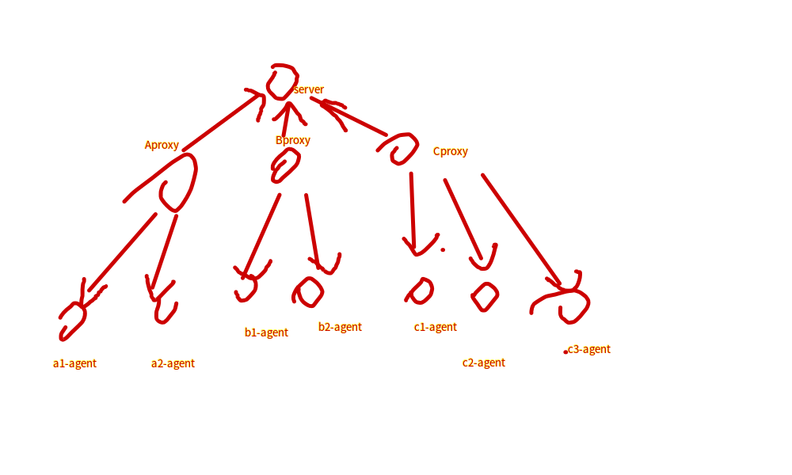

# zabbix分布式监控采集

```
主动模式和被动模式的区别
Zabbix的主动模式和被动模式都是相对agent来说的。一般情况下默认使用的是zabbix的被动模式，即zabbix server根据监控项定义的时间主动去收集zabbix agent上的数据，优点是能使用更多的模板，更具有灵活性，缺点是当zabbix agent节点过多的时候会增加zabbix server的负荷。主动模式就是zabbix agent将消息推送给zabbix server,优点是减轻了zabbix server的压力，缺点是所有的模板要修改为主动模式。

主动模式，agent/proxy主动推送数据到server
被动模式，agent/proxy等待server主动收集数据
```

要求:

    所有节点时间同步, 使用(chrony/ntpd)
    zabbix-proxy 使用 sqlite3(>=3.3.5) 作为存储数据库
    zabbix-proxy 需要部署在 centos7 以上的操作系统上 或者在 centos7 以下的系统上源码安装
    zabbix-proxy 需要和 zabbix-server 通信(代理只需要一个到 Zabbix 服务器的 TCP 连接。这种方式更容易绕过防火墙，因为您只需要配置一个防火墙规则。)
    补充: 有问题先看文件权限


测试架构:

    server+proxy(主动模式)+agent(被动模式)

    server: 172.30.2.27
    proxy: 172.30.2.19(192.168.180.6)主动模式
    agent: 192.168.9.114,172.30.2.30(192.168.180.4)



## 安装 server

略，参见 AliyunOS上安装配置 zabbix5 服务端

## 配置 server

- 创建代理
  - 管理-agent代理程序-创建
    - agent代理程序名称, 必须和 zabbix_proxy.conf 里的 Hostname 保持一致
    - 系统代理程序模式，选择"主动式"。主动 - 代理将连接到 Zabbix 服务器并请求配置数据，proxy配置里要设置为主动模式；被动- Zabbix 服务器连接到代理，proxy配置里要设置为被动模式
    - 代理地址，proxy的IP地址或者域名

- 添加自动注册主机的动作
    - 动作 "自动注册": 
      - 条件：当 agent名称=代理程序名称
      - 动作：添加linux主机; 添加linuxservices群组; 关联linux模板

## 安装 proxy

1. 在线安装

```bash
rpm -Uvh https://repo.zabbix.com/zabbix/5.0/rhel/7/x86_64/zabbix-release-5.0-1.el7.noarch.rpm
sed -i 's@repo.zabbix.com@mirrors.aliyun.com/zabbix@g' /etc/yum.repos.d/zabbix.repo
yum install zabbix-proxy-sqlite3
```

1. 离线安装

```bash
# 依赖, 这个顺序来安装
net-snmp-libs-5.7.2-49.el7_9.1.x86_64.rpm
OpenIPMI-libs-2.0.27-1.el7.x86_64.rpm
OpenIPMI-2.0.27-1.el7.x86_64.rpm
OpenIPMI-modalias-2.0.27-1.el7.x86_64.rpm
fping-3.16-1.el7.x86_64.rpm
libtool-ltdl-2.4.2-22.el7_3.x86_64.rpm
unixODBC-2.3.1-14.el7.x86_64.rpm
libevent-2.0.21-4.el7.x86_64.rpm
zabbix-proxy-sqlite3-5.0.20-1.el7.x86_64.rpm
```

## 配置 proxy


1. 初始化数据库 - sqlite3

    ```
    cd /var/run/zabbix/
    zcat /usr/share/doc/zabbix-proxy-sqlite3*/schema.sql.gz | sqlite3 zabbix.db
    chown zabbix.zabbix zabbix.db
    ```

2. 配置文件

    ```conf
    grep -Ev "#|^$" /etc/zabbix/zabbix_proxy.conf
    # Proxy工作模式。0 - 主动模式 1 - 被动模式。注意 当使用 Active proxy 时，敏感的 proxy 配置数据可供有权访问Zabbix server trapper端口的应用使用。 因为第三方应用可以假装是活动proxy并请求配置数据而不会进行身份验证。
    ProxyMode=0
    # 服务端地址
    Server=172.30.2.27
    # 确保Server端能正确解析这个proxy名称。允许的字符: 字母, '.', ' ', '_' 和 '-'.最大长度: 128
    Hostname=2-19
    LogFile=/var/log/zabbix/zabbix_proxy.log
    LogFileSize=0
    PidFile=/var/run/zabbix/zabbix_proxy.pid
    SocketDir=/var/run/zabbix
    DBName=/var/run/zabbix/zabbix.db
    DBUser=zabbix
    SNMPTrapperFile=/var/log/snmptrap/snmptrap.log
    Timeout=4
    ExternalScripts=/usr/lib/zabbix/externalscripts
    # 数据库查询消耗时间，大于该时间将会记入日志 (毫秒)。0 - 不记录慢查询日志。
    LogSlowQueries=3000
    StatsAllowedIP=127.0.0.1
    # 如果无法连接Zabbix server，proxy将保留数据N小时。\\旧数据将丢失。(1-720)
    ProxyOfflineBuffer=1
    # Proxy将在本地保留数据N小时，即使数据已与server同步。\\如果第三方应用程序将使用本地数据，则可以使用此参数。(0-720)
    ProxyLocalBuffer=0
    # zabbix proxy从zabbix server取得配置数据的频率，单位秒
    ConfigFrequency=60
    # 这个是proxy端向server端发送数据的时间，单位是秒，几乎等于实时同步
    DataSenderFrequency=1
    ```

3. 启动 zabbix-proxy

    ```
    systemctl start zabbix-proxy
    systemctl enable zabbix-proxy

    proxy启动后，日志中只会打印一些 proxy #2 started [trapper #1] 的日志
    proxy启动后，server服务器的日志会有输出 /var/log/zabbix/zabbix_server.log
    13504:20220301:104208.292 sending configuration data to proxy "2-19" at "172.30.2.19", datalen 3662, bytes 1299 with compression ratio 2.8
    server前端-agent代理程序，最近出现(持续)从 "从未" 显示为 "多少s"
    # Zabbix proxy没有前端。 它仅与Zabbix server通信
    ```

## 安装 agent


```bash
# centos7
wget -Nc https://repo.zabbix.com/zabbix/5.0/rhel/7/x86_64/zabbix-agent-5.0.20-1.el7.x86_64.rpm
rpm -ivh zabbix-agent-5.0.20-1.el7.x86_64.rpm

# centos6
wget -Nc https://repo.zabbix.com/zabbix/5.0/rhel/6/x86_64/zabbix-agent-5.0.20-1.el6.x86_64.rpm
rpm -ivh zabbix-agent-5.0.20-1.el6.x86_64.rpm
```

## 配置 agent


1. 配置文件

    ```conf
    grep -Ev "#|^$" /etc/zabbix/zabbix_proxy.conf
    PidFile=/var/run/zabbix/zabbix_agentd.pid
    LogFile=/var/log/zabbix/zabbix_agentd.log
    LogFileSize=0
    # 将 Server 的地址写成 proxy 的地址
    Server=172.30.2.19
    Hostname=9.114
    Include=/etc/zabbix/zabbix_agentd.d/*.conf
    # 允许将所有字符作为参数传递给用户定义的参数。 0 - 不允许 1 - 允许 不允许使用以下字符： \ ' " ` * ? [ ] { } ~ $ ! & ; ( ) < > | # @ 此外，不允许使用换行符。
    UnsafeUserParameters=1
    HostMetadata=linux
    ```

1. 启动 zabbix-agent

    ```bash
    service zabbix-agent status
    service zabbix-agent restart
    chkconfig --level 35 zabbix-agent on

    agent启动后，日志中只会打印一行这样的日志，说明设置了 ServerActive 参数，注释后不会出现
    20319:20220301:154041.113 active check configuration update from [172.30.2.19:10051] started to fail (ZBX_TCP_READ() timed out)
    ```

## 参考文档

- [zabbix-proxy 说明](https://www.zabbix.com/documentation/5.0/zh/manual/distributed_monitoring/proxies)
- [zabbix-proxy 安装](https://www.zabbix.com/documentation/5.0/zh/manual/installation/install)
- [zabbix-proxy 安装 - centos](https://www.zabbix.com/documentation/5.0/zh/manual/installation/install_from_packages/rhel_centos)
- [zabbix-proxy 配置](https://www.zabbix.com/documentation/5.0/zh/manual/appendix/config/zabbix_proxy)