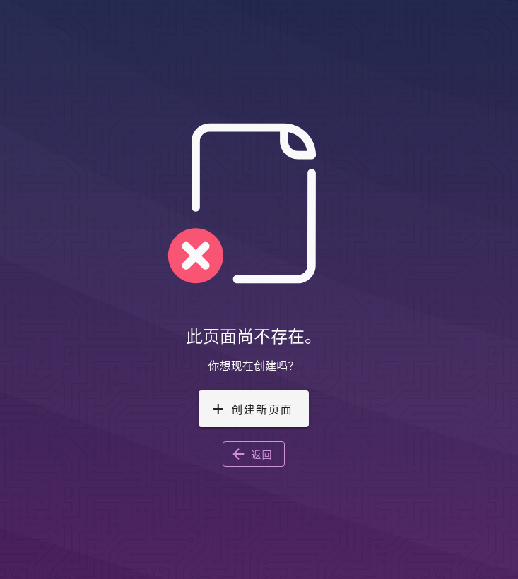

在wiki.js上面创建中文目录，显示英文url

wiki.js是一个开源的知识库软件，特点是不用单独创建目录结构，只需要在新建页面时把路径写好，wiki.js会自动的把路径渲染好

假装已经安装好了wiki.js服务并且中文、首页已经操作过了

现在来创建一个页面，看红框处可以发现，我在page1前面写了一层目录one，这个路径是最终浏览器地址栏显示的路径；然后点“选择”进入页面编辑界面

这时让选择一个编辑器，我选择“Markdown”

让设置页面的一些属性，把标题写成“页面1”，然后点“OK”，现在就可以写文章正文了

写完只会，在右上角点击“创建”，提示"渲染中"。页面第一次创建完成后，会自动跳转到页面的最终浏览状态；如果是修改某个页面，保存后还会留在编辑页面。

到这页面就创建并且发布了，可以看到地址栏的url就是刚刚写的one/page1，左侧菜单栏的页面名字就是标题“页面1”

现在url已经是英文了，接下来就是把左侧菜单栏名字以中文的方式显示。回到首页，可以看到目录叫one，这不用管它，再回到刚发布的文章页面

回到文章页面后，可以看到红框的位置，点击它，会提示你“此页面尚不存在。”，那就创建它

然后创建新页面，选择编辑器，现在能看到路径是刚刚点击的one，标题我写成了“测试发布”，点OK，填一些内容，创建

创建后的页面，自动跳转到最终浏览状态

现在可以看到左侧菜单栏的“one”目录没有了，显示的是“测试发布”，右侧显示的路径是刚刚创建的那个页面

进入到测试发布目录，可以看到刚开始创建的"页面1"，多了一个“测试发布”的页面，而且目录显示的“one”变成了“测试发布”

再来看看最终效果，目录显示中文，地址栏url显示英文

注意：url是在渲染时生成的，目录需要先写成英文的，再去目录下其中一个页面的导航栏点击目录，创建一个中文的页面。我试了先创建中文目录，url会变成中文，即使创建了中/英文的文件，也不能改变url地址了。

官方文档上写没写这种操作方法不知道，我是没找到。摸索到这种方式了，就记下来吧

还有一些坑，也记下来

- wiki.js中有一些关键字是不能用作目录名称的，比如kb；所以起名字的时候使用一些的单词或短语
- 如果使用docker-compose方式部署，官网提供docker-compose.yaml文件中，镜像`requarks/wiki:2`是版本 2 的系列的统称，就像latest，可能在某个时间点的镜像是不稳定的；可以在<https://hub.docker.com>上面搜索，选择一个稳定的版本使用
