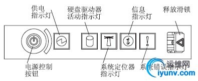

**操作员信息面板**

操作员信息面板指示诸如主板错误、以太网活动和电源状态的信息。

 

- 电源控制按钮：按下此按钮可手动开启和关闭服务器。服务器自带的电源控制按钮罩可防止意外关闭服务器。

- 电源指示灯：
  - 如果此指示灯点亮且不闪烁，表示服务器已开启。
  - 如果此指示灯闪烁，表示服务器已关闭但仍然连接到交流电源。
  - 如果此指示灯熄灭，表示已切断交流电源或者电源或指示灯本身发生故障。

  注：如果此指示灯熄灭，并不表示服务器没有电能。此指示灯可能已烧毁。要使服务器彻底断电，必须从电源插座断开所有电源线。

- 硬盘驱动器活动指示灯：如果此指示灯闪烁，表示正在使用相应的硬盘驱动器。
- 系统定位器指示灯：使用此指示灯可以用肉眼从多个服务器中找出特定的服务器。您可以使用IBM Director 远程点亮此指示灯。

- 信息指示灯：如果此指示灯点亮，表示发生了一般错误。同时光通路诊断面板上的指示灯也会点亮以帮助您确定错误来源。

- 系统错误指示灯：如果此指示灯点亮，表示发生了系统错误。同时光通路诊断面板上的指示灯也会点亮以帮助您确定错误来源。

- 释放滑锁：将该滑锁滑向左侧可操作光通路诊断面板。
