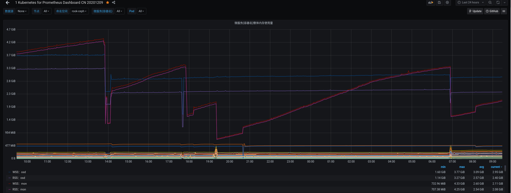
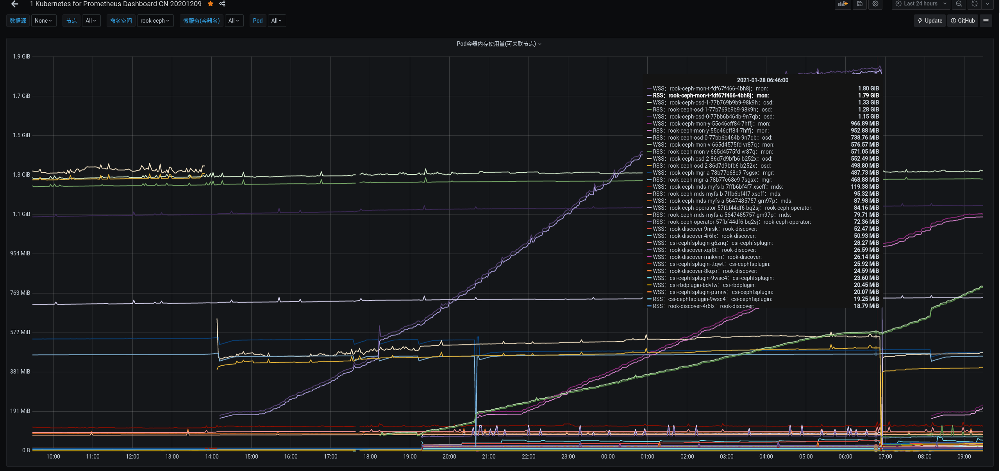

# Kubernetes

---

## 问题记录

1. master节点禁止调度 SchedulingDisabled

    ```bash
    # 向master节点添加污点
    kubectl taint nodes node1 key=value:NoSchedule
    # 该命令为节点 node1 添加了一个污点。污点是一个键值对，在本例中，污点的键为 key，值为 value，污点效果为 NoSchedule。此污点意味着 Kubernetes 不会向该节点调度任何 Pod，除非该 Pod 有一个匹配的容忍（toleration）
    eg: kubectl taint nodes master1 node.kubernetes.io/unschedulable=:NoSchedule
    ```

    Pod 中存在属性 Node selector / Node affinity，用于将 Pod 指定到合适的节点。

    节点中存在属性 污点 taints，使得节点可以排斥某些 Pod。

    污点和容忍（taints and tolerations）成对工作，以确保 Pod 不会被调度到不合适的节点上。
    + 可以为节点增加污点（taints，一个节点可以有 0-N 个污点）
    + 可以为 Pod 增加容忍（toleration，一个 Pod 可以有 0-N 个容忍）
    + 如果节点上存在污点，则该节点不会接受任何不能容忍（tolerate）该污点的 Pod。

2. 长时间运行,etcdLeader频繁变动，导致业务系统频繁重启
   + 集群状态
     1. 集群运行200天+
     2. 2Master，4Node，3Etcd，清一色4C16G，底层是OpenStack
     3. 跑着rook-ceph(3osd), prometheus, loki, portainer, 一套业务系统(不到20个SpringBoot)
   + 注意点
     + mon和osd节点尽量不与etcd节点重用，如图
     
     

3. 注意频繁重启的Pod
